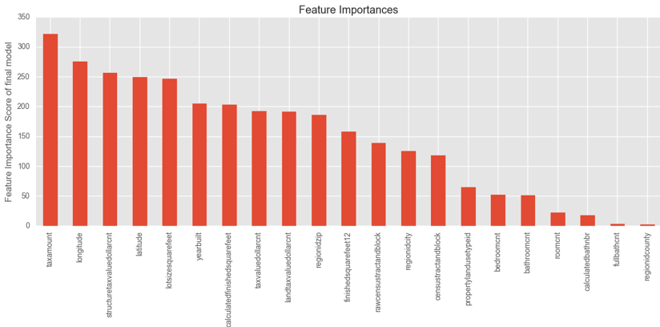
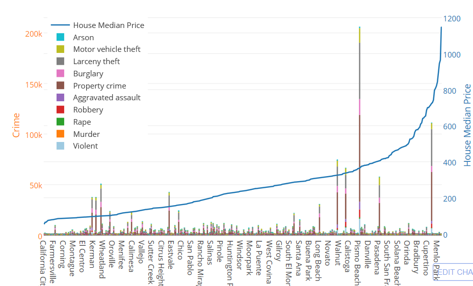
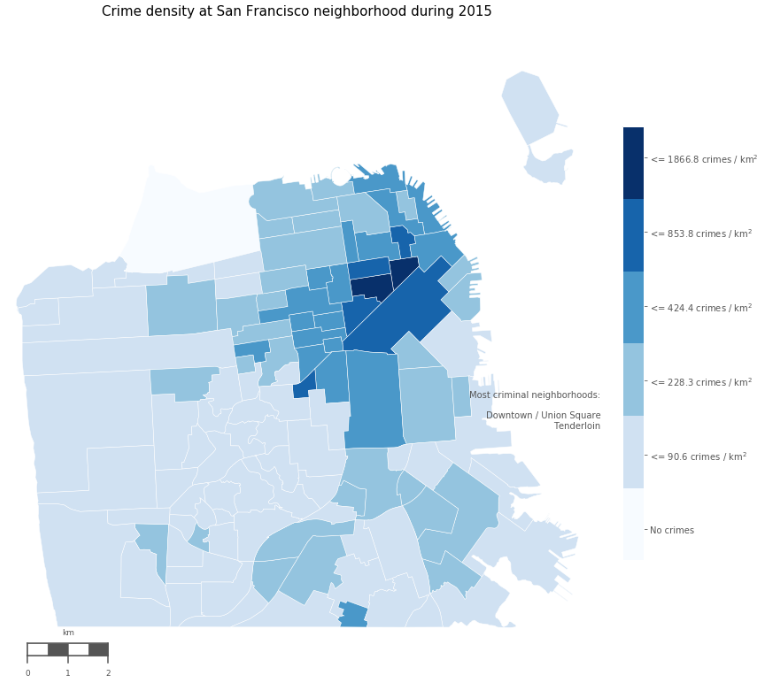

## Welcome to GitHub Pages

### About me

I am currently a master student at UC Davis in Math Statistic and Civil Engineering Department. Before this, I earn my Bachelor degree from Tongji University in China. I have taken many machine learning, deep learning competitions, part of those can be find here, if you want to see more, you can go to my GitHub page which is shared at the end of the document. I am correctly doing research on NLP and building ChatBox, and I hope I will work as a Data Scientist or machine learner in the future.

 

### Taken or taking course

1. [Data Science Technology (interactive data visualization with Web technology)](https://www.stat.ucdavis.edu/courses/expanded-course-descriptions/sta-141B.html)
2. [Advance Statistic Computing (High-performance computing in python)](https://www.stat.ucdavis.edu/courses/expanded-course-descriptions/sta-141C.html)
3. [Statistic Method Machine Learning](https://jsharpna.github.io/208/index.html)
4. [Applied Data Science with Python (coursra)](https://www.coursera.org/specializations/data-science-python)

 

### Project

[**Machine Learning Project**]( http://htmlpreview.github.io/?https://github.com/wzxiong/DAVIS-Machine-Learning/blob/master/208-final-project-xll/Code/finalproject.html)

Kaggle Competition: Zillow’s Home Value Prediction (Zestimate):

* Data preprocess, operate on missing data
* Stacking Regression(Ridge regression, Random Forest, Support Vector Machine)
* XGBOOST
* Neuro Network

 

 

[**141B-Final Project： What affect California home price**]( http://htmlpreview.github.io/?https://github.com/wzxiong/What-affects-home-price-in-California/blob/master/STA%2B141B%2BProject%2BHouse%2BPrice.html)

This project tends to find the relationship between public school rating and racial composition and their influences in home prices. In addition, we examine the relationship between crime occurrence and house price. In the end, we use web scraping to predict the trend of the house price.

 

 

[**Interesting points in San Francisco**]( http://htmlpreview.github.io/?https://github.com/wzxiong/Interesting-points-in-SF/blob/master/Analyzing%2Binteresting%2Bpoints%2Bin%2BSan%2BFrancisco%2B.html)

This project tried to find out some interesting points in San Francisco, including analysing:

* housing price
* crime data
* noise problem
* food vendor truck

 
 

For more details see [My GitHub](https://github.com/wzxiong).
